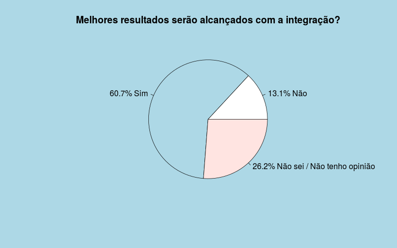

```{r setup, include=FALSE}
if (!require(readxl)) install.packages('readxl')
library(readxl)
```
**Autores:**  
*Caio Gabriel*  
*Lawrence Faccine Jr.*  
*Lucas Fadel*

  
## Introdução
  Este trabalho é referente a uma pesquisa feita sobre o uso de redes sociais pelos discentes e docentes da universidade, e o que os mesmos acham sobre a utilização das redes sociais pelos professores/universidade com intuito educacional e dessa aproximação dos alunos com os professores/universidade.  
  
  Com base em um questionário aplicado na Universidade Estadual Paulista - UNESP no campus de Bauru, este trabalho visa responder a seguinte pergunta de pesquisa:  
    
  > **_Quais são as influências das mídias sociais sobre discentes da instituição de nível superior unesp - Bauru - SP?_**  
  
***  
## Perfil dos participantes 
  Essa pesquisa contou com 61 respostas validas para gerar seus resultados, o perfil dos participantes foi levantado através de perguntas sobre gênero, idade, estado civil e filhos.  Foi constatado que os participantes dessa pesquisa em sua totalidade são solteiros e não possuem filhos. Fato provavelmente justificado pela faixa etária dos participantes e pelo alvo da pesquisa ter sido uma universidade. 
  

  
  Os participantes foram em sua maioria homens, sendo 37  homens contra 24 mulheres, e entre 21 e 25 anos. Como mostrado no gráfico abaixo.
  
  

***  
  
## Redes Sociais

  Rede social é uma plataforma cujo objetivo é conectar pessoas e compartilhar informações entre elas, tanto de caráter pessoal ou profissional, quanto educacional ou comercial. Elas se materializam na forma de sites e aplicativos, reunindo usuários que compactuam dos mesmos valores e interesses.  
  Com a rápida acensão das redes sociais, diversas dinâmicas do nosso cotidiano mudaram: buscas por emprego, amigos, compras, entre outros estão cada vez mais compreendidas dentro das redes sociais. 
  
  E é nesse cenário que as redes de ensino se encontram e necessitam analisar quais são as vantagens, desavantagens e empecilhos para poderem, ou não, adentrarem de vez nessa nova era da tecnologia. 
  
***  

## Pesquisa
Esta pesquisa tentou entender tanto o perfil de uso das redes sociais pelos respondentes quanto seu posicionamento sobre a utilização de redes sociais no âmbito acadêmico. Através de pergunta sobre o tempo gasto em redes sociais e quais são as mais utilizadas, a pesquisa pode entender com qual afinco esse publico utiliza as redes no seu dia a dia.


Os motivos de uso das redes também foi consultado, mostrando bastante sobre o perfil de uso dos respondentes, onde os usuários demonstram utilizar redes sociais principalmente para manter-se atualizado e em contato com grupos de amigos.

 

### Redes Sociais na Universidade

  No campo institucional, criar planos para que a universidade participe destes meios pode potencializar ainda mais a ligação dos alunos e funcionários com a universidade. Em sala de aula, as redes sociais permitem que estudantes e professores usem a criatividade, promovam debate, gerem conteúdos e aprendam. 62.3% dos que responderam a pesquisa, acham que sim, o professor deve utilizar as mídias sociais como uma forma de interação das aulas e 31.1% concordam mas com restrições.
  
  Apesar de mais de 62% dos participantes acreditarem que as redes sociais devem ser utilizadas pelos professores, apenas 37,7% acreditam que essa é a melhor maneira de aproximação dos professores com os alunos. O gráfico abaixo ilustra isso. 
  
  
  
   Como são utilizadas diariamente, os usuários já estão acostumados e sabem muito bem utilizar essas plataformas, então utilizá-las essas redes sociais mais acessadas para aproximar os alunos do professor e da universidade pode ser bem efetiva mas ainda não deve ser o único meio de interação entre as partes. Segundo os dados coletados na pesquisa, o Whatsapp é a plataforma mais utilizada, seguido pelo Youtube e Facebook.  
    

     
  Além disso, dentre os respondentes, 60.7% acreditam que os alunos alcançarão melhores resultados se as mídias sociais estiverem integradas às aulas e/ou atividades. O que é um belo incentivo para se começar a utilizá-las em ambiente educacional.
  

  
***  
### Principais dificuldades do uso de redes sociais academicamente
Os participantes da pesquisa apontaram as principais dificuldades, segundo eles, que complicariam a utilização das redes sociais no âmbito acadêmico (Figura 12). O problema mais destacado seria a grande possibilidade e facilidade de distração que as redes sociais oferecem sendo assim uma grande ferramenta contra produtiva e possivelmente o maior obstaculo para a utilização das redes sociais como meio de interação de alunos e professores.


## Recursos das redes sociais
No questionário os participantes encontraram uma tabela com alguns recursos oferecidos pelas redes sociais e foram instruídos para avaliarem o impacto desses recursos na educação. Os recursos com melhor avaliação foram a possibilidade da troca de informações entre professores e alunos entre si.
Nenhum recurso foi visto de maneira negativa pelos participantes, nó máximo de maneira indiferente.


## Conclusão
As redes sociais abrem um grande leque de possibilidades para os professores e para os alunos, facilitando a comunicação, disseminação e distribuição de conteúdo, graças a grande presença que as redes sociais tem nas vidas de grande parte da população. Mas apesar disso a utilização dessas mídias ainda pode trazer malefícios e deve ser analisada minunciosamente para que os objetivos sejam alcançados e os malefícios, como procrastinação e dispersão, sejam evitados ao máximo.
Como a grande maioria do mercado, o setor da educação tende cada vez mais ser integrado a essas redes seja elas como forma de apoio, divulgação ou integração entre professores e alunos. Logo as instituições devem pensar em alternativas e se prepararem para entrar nessa era.  
